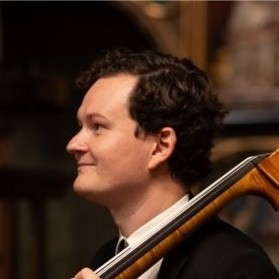
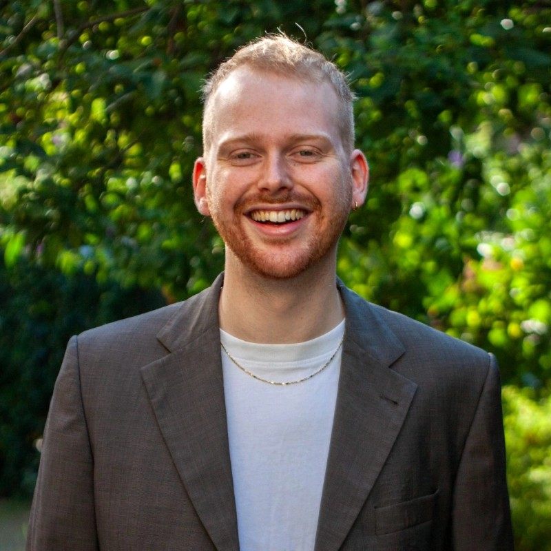

# Third Places

The term **third place** was coined by sociologist Ray Oldenburg in his 1989 book *The Great Good Places*. Third Places are spaces open to the public in which they can informally gather, mingle, and pass time, such as restaurants, cafés, bookstores, or libraries. The term "Third Place" stems from the distinction from "First Places" (the home) and "Second Places" (work and education). See Methodology for a full list of Third Places included in our definition.

The Third Place Index, following a publication from the US by [Evan O'Neil](https://thirdplaceindex.org/#about), maps the availability of Third Places in the Netherlands. It gives a score to each area ranging from 0 to 100 describing how good the availability of Third Places is compared to other areas in the Netherlands. Low numbers indicate places with few Third Places and with higher danger of isolation while higher numbers indicate a wider availability of community building.

[View the full description of the methodology](./methodology.html)

# The Authors

### Tim Florschütz

Tim Florschütz is a PhD candidate at the Pandemic and Disaster Preparedness Centre (PDPC), working on innovative infectious disease control with a focus on contact tracing. Background in infectious disease epidemiology and veterinary medicine.

<a href="https://www.linkedin.com/in/tim-florschutz/?locale=nl" target="_blank">LinkedIn</a>

### Aidan Kloots

Aidan Kloots is a Research Coordinator and Researcher with strong data science background who enjoys healthcare data and closing unfair gaps in healthcare. Over three years he worked daily in R with Shiny, complemented by Python and SQL. He built a Digital Twin Shiny app for PLGA microsphere production where he used Machine Learning from raw process data, trained Random Forest models to predict quality outcomes, and used Bayesian Networks to map probabilistic dependencies between process parameters and critical quality attributes. He models interactive dashboards for stakeholders and prioritise interpretability so clinicians can trust on model outputs.

<a href="https://www.linkedin.com/in/aidankl/" target="_blank">LinkedIn</a>

### Till Hovestadt

Till Hovestadt is a data scientist, computational social scientist, and doctoral researcher at Nuffield College and the University of Oxford. With his work he aims to provide evidence-based predictions, policy recommendations, and analyses based on rigorous data science, machine learning, and statistical analyses.

<a href="https://www.linkedin.com/in/till-hovestadt/" target="_blank">LinkedIn</a>

# Acknowledgements

This project developed as part of the Summer Institute of Computational Social Science ([SICSS](https://sicss.io/2026/odissei/)) 2026 at ODISSEI Nederland. We want extend our gratitude to the organisers of the SICSS, most notably [Tom Emery](https://www.eur.nl/people/tom-emery), [Angelica Maineri](https://odissei-data.nl/nl/teammember/dr-angelica-maineri/), [Javier Garcia Bernardo](https://www.uu.nl/staff/JGarciaBernardo), and [Tadas Bernotas](https://www.eur.nl/people/tadas-bernotas). Last but not least, we want to thank the other [participants](https://sicss.io/2026/odissei/people) of the SICSS ODISSEI 2026.

